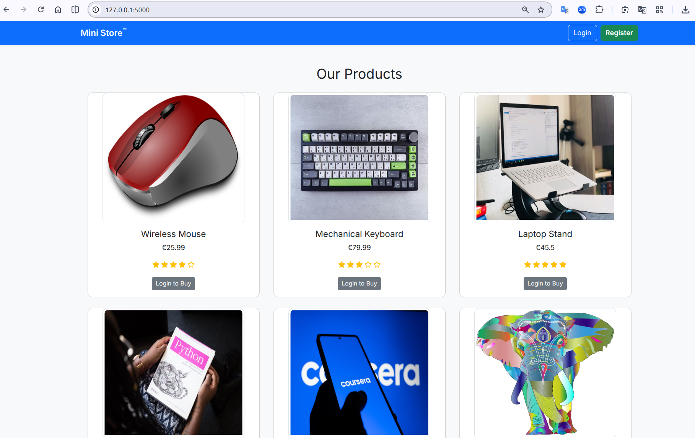
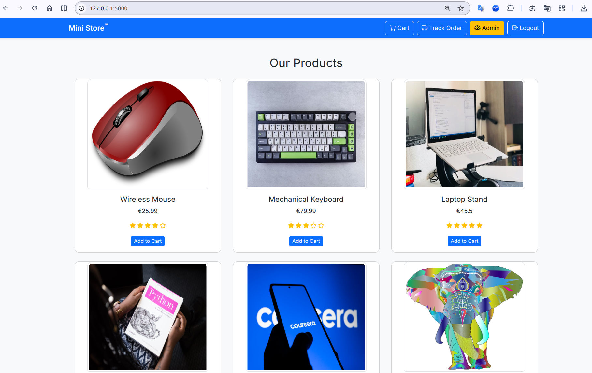
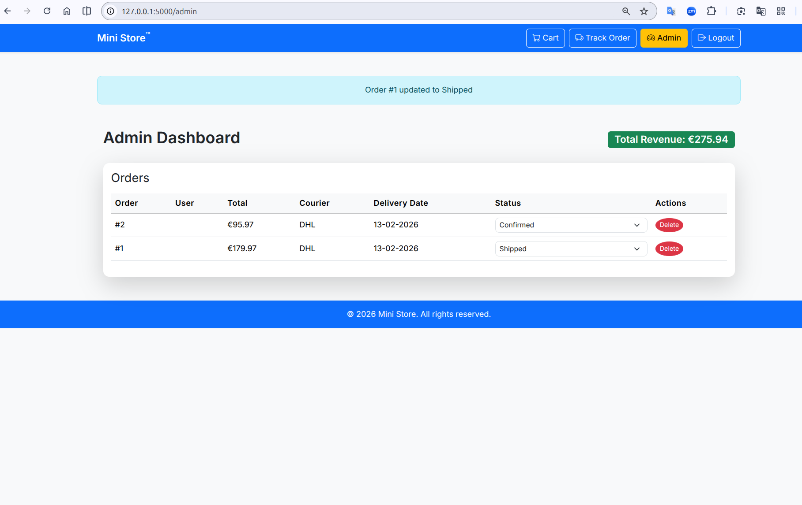

# Mini E-Commerce Web App

A full-stack e-commerce web application built with Flask, featuring:

- User authentication
- Shopping cart system
- Order checkout
- Admin dashboard
- Order tracking
- Invoice PDF generation

## Features
- Amazon-style checkout flow
- Multiple payment options
- Admin order management
- Shipment tracking
- Responsive Bootstrap UI

## Tech Stack
- Python (Flask)
- SQLite (SQLAlchemy)
- Bootstrap 5
- Jinja2 Templates

## Installation

1. Clone the repo:
   git clone https://github.com/yourusername/mini-ecommerce.git

2. Navigate into the project:
   cd mini-ecommerce

3. Create virtual environment:
   python -m venv venv

4. Activate environment:
   source venv/bin/activate   (Linux/Mac)
   venv\Scripts\activate      (Windows)

5. Install dependencies:
   pip install -r requirements.txt

6. Run the app:
   python app.py

## Admin Access
Create an admin user via the registration route or script.

## Screenshots

## Future Improvements
- Payment gateway integration
- Email notifications
- Product search and filtering
- Deployment to cloud platform

## Contributing
We welcome contributions from the community. If you would like to improve this project, please feel free to fork the repository and submit a pull request.
To ensure a smooth contribution process, kindly review the [Contributing Guidelines](CONTRIBUTING.md) before making any changes.

